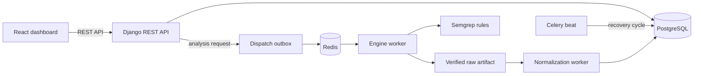

# Toy SAST

KISA 구현단계 보안약점 기준으로 소스 코드를 분석하는 포트폴리오용 정적 분석 서비스입니다. Java, JavaScript, Python 프로젝트를 대상으로 Semgrep 규칙을 실행하고, 분석 진행 상태와 발견된 취약점을 웹 대시보드에서 확인할 수 있습니다.

> 이 저장소는 로컬 Docker Compose 환경에서 기능과 설계를 시연하기 위한 프로젝트입니다. 운영 배포 구성을 포함하지 않습니다.

## 주요 기능

- JWT 인증과 역할 기반 관리자/사용자 화면
- ZIP 업로드, Git 저장소 URL, 내부 샘플 경로를 통한 분석 소스 등록
- 업로드 아카이브의 경로 순회, 심볼릭 링크, 압축 폭탄 등 사전 검증
- 소스 파일 기반 Java, JavaScript, Python 자동 감지
- 대용량 프로젝트를 파일 단위 chunk로 분할하는 비동기 분석
- repository 전체 snapshot을 한 번에 검사하는 `repository_v2` 파이프라인과 기존 `chunk_v1` 호환 경로
- Celery, Redis, PostgreSQL을 이용한 작업 실행과 상태 관리
- lease, retry, outbox 기반의 중복 실행 방지 및 작업 복구
- KISA 보안약점 카탈로그와 Semgrep 결과 정규화
- 분석 이력, 진행률, 취약점 상세 결과 대시보드

## 아키텍처



분석 요청은 DB에 실행 계획과 outbox를 먼저 기록합니다. Worker는 chunk를 claim한 뒤 lease가 유효한 동안 Semgrep을 실행하며, Beat 작업은 유실된 worker와 미발행 outbox를 주기적으로 복구합니다.

`repository_v2`는 분석 생성 시 선택한 pipeline version을 고정하고, 불변 snapshot root 하나를 대상으로 실행한 raw 결과를 artifact로 게시한 뒤 별도 normalization 단계에서 finding을 생성합니다. release-1 범위, capability 제한, 활성화/롤백 및 검증 절차는 [Repository-scope SAST 운영 가이드](docs/repository-scope-sast.md)를 참고하세요.

### Repository-scope SAST 실행 모델

- 분석 생성 시 `chunk_v1` 또는 `repository_v2`를 저장하며, 실행 중 설정이 변경되어도 경로가 바뀌지 않습니다.
- `repository_v2`는 Java, JavaScript, Python 파일이 섞인 불변 snapshot 전체를 하나의 repository execution으로 검사합니다.
- Semgrep 원본 결과는 크기와 SHA-256을 검증한 뒤 canonical artifact로 게시됩니다.
- Finding 생성은 별도 normalization outbox와 lease를 사용합니다. normalization 재시도는 Semgrep을 다시 실행하지 않습니다.
- Engine과 normalization outbox는 각 attempt의 claim 소유권을 기록해 중복 worker와 stale claim을 차단합니다.
- Worker 유실, published-but-unclaimed outbox, 만료된 lease, 손상된 artifact는 recovery cycle에서 재검증하거나 실패 상태로 수렴합니다.
- timeout 또는 취소 시 등록된 process session과 시작 시각을 확인한 뒤 소유한 process group만 종료합니다.
- 기존 API와 대시보드는 synthetic chunk와 호환 진행률을 통해 `chunk_v1` 및 `repository_v2`를 함께 표시합니다.

## 기술 스택

| 영역 | 기술 |
| --- | --- |
| Frontend | React 19, Vite, React Router |
| Backend | Django 5.2, Django REST Framework, Simple JWT |
| Analysis | Semgrep, custom KISA rule catalog |
| Async | Celery, Redis |
| Database | PostgreSQL 17 |
| Environment | Docker Compose |

## 프로젝트 구조

```text
toy_sast/
├── backend/
│   ├── accounts/          # 인증, 사용자, 권한 API
│   ├── projects/          # 프로젝트와 소스 버전 관리
│   ├── scans/             # 분석 모델, 작업, 서비스, 복구 로직
│   ├── semgrep_rules/     # KISA 기준 언어별 Semgrep 규칙과 fixtures
│   └── tests/             # 통합 및 수동 검증 도구
├── frontend/src/
│   ├── api/               # API client와 응답 정규화
│   ├── auth/              # 인증 상태와 token refresh
│   ├── components/        # 공통 UI와 취약점 표시 컴포넌트
│   └── pages/             # 로그인, 관리자, 사용자 대시보드
├── scripts/               # 구조 및 API 경계 검사 도구
└── compose.yaml
```

## 로컬 실행

Docker와 Docker Compose가 필요합니다.

```bash
cp .env.example .env
```

`.env`의 `DJANGO_SECRET_KEY`와 `POSTGRES_PASSWORD`를 로컬 값으로 변경한 다음 서비스를 시작합니다.

새 분석에 repository pipeline을 사용하려면 `.env`에 다음 값을 설정합니다. 기본값은 `False`이며, 이미 생성된 분석의 pipeline version에는 영향을 주지 않습니다.

```dotenv
REPOSITORY_SAST_V2_ENABLED=True
```

```bash
docker compose up -d --build
docker compose exec backend python manage.py migrate
docker compose exec backend python manage.py sync_kisa_security_weaknesses
docker compose exec backend python manage.py createsuperuser
```

- Web UI: <http://localhost:5173>
- Django admin: <http://localhost:8000/admin/>
- REST API: <http://localhost:8000/api/>

종료할 때는 데이터 볼륨을 유지한 채 다음 명령을 사용합니다.

```bash
docker compose down
```

## 검증

```bash
# Backend configuration
docker compose exec backend python manage.py check
docker compose exec backend python manage.py makemigrations --check --dry-run

# Repository-v2 contract, acceptance, normalization/recovery, E2E
docker compose exec backend python manage.py test \
  scans.test_repository_v2_contract \
  scans.test_repository_v2_acceptance \
  scans.test_repository_v2_normalization \
  scans.test_repository_v2_e2e

# Repository-v2 limits, schema, capabilities and Semgrep pin
docker compose exec backend python manage.py check_repository_scan_pipeline

# KISA rule catalog
docker compose exec backend \
  python manage.py check_kisa_rule_catalog --full-coverage

# Frontend
docker compose exec frontend npm test
docker compose exec frontend npm run lint
docker compose exec frontend npm run build

# Repository boundaries
python3 scripts/check_frontend_api_boundaries.py
python3 scripts/code_structure_audit.py
python3 scripts/project_cleanup_audit.py
```

현재 repository-v2 검증 묶음은 65개 테스트로 snapshot 무결성, outbox claim과 재처리, artifact 게시와 정리, normalization 재시도, coverage, 진행률/API 호환, timeout·취소 및 process-group 복구를 확인합니다. 마지막 최소 기능 점검에서는 백엔드 65개 테스트와 Django check, migration check, 프런트 테스트·lint·production build가 모두 통과했습니다.

## 보안 관련 안내

- 실제 환경값과 업로드 파일은 각각 `.env`, `backend/media/`에 저장되며 Git에서 제외됩니다.
- `backend/semgrep_rules/tests/`와 `backend/internal_sources/`에는 탐지 검증을 위한 의도적으로 취약한 코드가 포함됩니다.
- 업로드 아카이브는 분석 전에 파일 수, 크기, 압축률, 경로, 링크 유형을 검사합니다.
- 이 프로젝트는 포트폴리오 및 로컬 시연 용도이며 TLS, 운영 secret 관리, 외부 저장소 인증 같은 배포 구성은 범위에 포함하지 않습니다.
